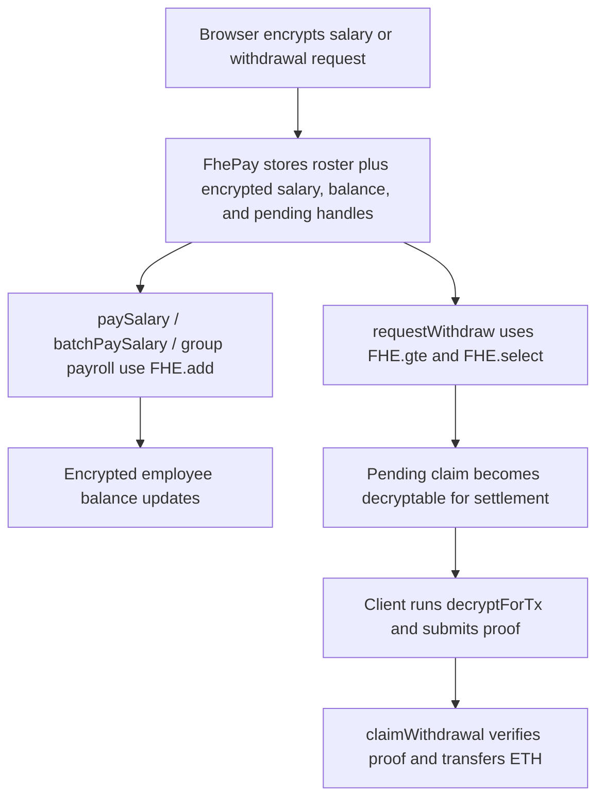

# FhePay

FhePay is a confidential payroll app on Ethereum Sepolia built with Fhenix CoFHE. Employers can fund a treasury, set encrypted salaries, run payroll, and let employees claim verified ETH payouts without exposing payroll balances on-chain.

Live app: [https://fhepaye.vercel.app](https://fhepaye.vercel.app)

Official CoFHE docs: [https://cofhe-docs.fhenix.zone/](https://cofhe-docs.fhenix.zone/)

## Team

- [@happypapa636](https://github.com/happypapa636)
- [@vivekjks](https://github.com/vivekjks)

## Live Deployment

- Contract: [0xd36A6AA303b4c17eCBDB5c0f47B9f216683436CC](https://sepolia.etherscan.io/address/0xd36A6AA303b4c17eCBDB5c0f47B9f216683436CC)
- Owner: [0x5170da78525944160e88B0071342ECAcF9dc47a2](https://sepolia.etherscan.io/address/0x5170da78525944160e88B0071342ECAcF9dc47a2)
- Network: Ethereum Sepolia
- Frontend env: `VITE_FHEPAY_ADDRESS=0xd36A6AA303b4c17eCBDB5c0f47B9f216683436CC`
- Vercel env: Production and Preview target the same contract
- Package line: `@cofhe/sdk@^0.5.2`, `@cofhe/hardhat-plugin@^0.5.2`, `@fhenixprotocol/cofhe-contracts@^0.1.3`

## What It Does

- Encrypts salaries, balances, bonuses, and withdrawal requests as `euint128`
- Settles claims from a real ETH treasury
- Runs single payroll, batch payroll, and payroll-group payroll
- Protects pay cycles with configurable intervals
- Tracks an on-chain roster and active/inactive payroll status
- Lets employees decrypt only their own salary and balance
- Lets employees request, claim, or cancel confidential withdrawals
- Supports delegated payroll admins, treasury admins, and two-step ownership transfer
- Supports auditor disclosure for employee-scoped encrypted handles
- Supports CSV employee import, confidential bonuses, treasury alerts, and upkeep-compatible automation hooks

## Wave History

### Wave 1 - Confidential Payroll Prototype

- Built the first employer/employee payroll console
- Proved browser-side salary encryption into an on-chain FHE contract
- Stored payroll state as encrypted handles instead of plaintext values

### Wave 2 - App Flow and Wallet Readiness

- Split the UI into clearer employer and employee flows
- Added wallet/network readiness states for Sepolia
- Improved transaction feedback and contract status visibility

### Wave 3 - Confidential ETH Settlement

- Upgraded payroll amounts to `euint128`
- Added an ETH treasury and proof-backed claim settlement
- Implemented `decryptForTx` plus `claimWithdrawal`
- Added employee self-permit reads with `decryptForView`

### Wave 4 - Production Readiness

- Added public employee directory and active/inactive roster controls
- Added batch payroll with a max batch size
- Added pay interval protection against accidental duplicate payroll
- Added `cancelWithdrawal()` so employees can restore pending claims to encrypted balance
- Hardened frontend amount parsing and build stability

### Wave 5 - Final Completed 🥰

- Added OpenZeppelin two-step ownership transfer for Safe-ready handoff
- Added delegated payroll and treasury admin roles
- Added selective auditor disclosure and auditor review UI
- Added payroll groups, group cadences, group members, and upkeep hooks
- Added CSV import and confidential bonus flows
- Added treasury alert threshold checks that can block payroll when liquidity is below the configured floor
- Made batch and group payroll skip inactive, locked, or not-due employees instead of reverting the full run
- Disabled ownership renounce to avoid orphaning the contract
- Added a polished home page, visual proof-flow page, Vercel SPA routing, and final live deployment

## Architecture

### Smart Contract

`[contracts/contracts/FhePay.sol](contracts/contracts/FhePay.sol)`

Main capabilities:

- `transferOwnership(address)` / `acceptOwnership()`
- `setPayrollAdmin(address, bool)`
- `setTreasuryAdmin(address, bool)`
- `setAuditor(address, bool)`
- `grantAuditorAccess(address, address)`
- `revokeAuditorAccess(address, address)`
- `setSalary(address, InEuint128)`
- `paySalary(address)`
- `batchPaySalary(address[])`
- `createPayrollGroup(string, uint64)`
- `setPayrollGroup(uint256, string, uint64, bool)`
- `setPayrollGroupMember(uint256, address, bool)`
- `payPayrollGroup(uint256)`
- `checkUpkeep(bytes)` / `performUpkeep(bytes)`
- `grantBonus(address, InEuint128)`
- `setEmployeeActive(address, bool)`
- `setPayInterval(uint64)`
- `setTreasuryAlertThreshold(uint256)`
- `fundTreasury() payable`
- `requestWithdraw(InEuint128)`
- `cancelWithdrawal()`
- `claimWithdrawal(uint128, bytes)`

Confidential state:

- Salary per employee
- Balance per employee
- Pending withdrawal amount per employee

Public operational state:

- Employee directory and active status
- Treasury balance and alert threshold
- Payroll interval and last paid timestamp
- Delegated admin roles
- Auditor registry and employee disclosure grants
- Payroll groups and recurring schedules

### Frontend

`[frontend/](frontend/)`

The frontend is a Vite + React + wagmi app. It handles:

- Wallet connection and Sepolia readiness
- CoFHE client connection
- Salary and withdrawal encryption
- Employer payroll operations
- Employee decrypt/withdraw/claim flows
- Auditor decrypt-only review
- Payroll groups, CSV import, bonuses, treasury settings, and transaction receipts

### CoFHE Flow




Relevant docs:

- [Client SDK overview](https://cofhe-docs.fhenix.zone/client-sdk/introduction/overview)
- [FHE library overview](https://cofhe-docs.fhenix.zone/fhe-library/introduction/overview)
- [Permits](https://cofhe-docs.fhenix.zone/client-sdk/guides/permits)
- [Decrypt to transact](https://cofhe-docs.fhenix.zone/client-sdk/guides/decrypt-to-tx)
- [Access control](https://cofhe-docs.fhenix.zone/fhe-library/core-concepts/access-control)

## User Flows

### Employer / Payroll Admin

1. Connect on Sepolia.
2. Fund the treasury.
3. Set pay interval and treasury alert threshold.
4. Add employees with encrypted salaries.
5. Pause/reactivate roster entries.
6. Import CSV rows, create payroll groups, grant bonuses, or grant auditor access.
7. Run single, batch, group, or upkeep-driven payroll.

### Employee

1. Connect the employee wallet.
2. Decrypt salary and balance locally with a self permit.
3. Request a confidential withdrawal.
4. Claim ETH with a verified proof.
5. Cancel a pending claim if the amount should return to encrypted balance.

### Auditor

1. Connect an enabled auditor wallet.
2. Enter an employee address with an active disclosure grant.
3. Decrypt only the granted salary, balance, or pending withdrawal handles.

## Local Development

### Contracts

```bash
cd contracts
npm install
npm run build
npm test
```

### Frontend

```bash
cd frontend
npm install
npm run build
npm run dev
```

## Deploying

From the repo root:

```bash
cd contracts
npm run deploy:sepolia
```

Expected env vars:

- `PRIVATE_KEY` or `DEPLOYER_PRIVATE_KEY`
- `SEPOLIA_RPC_URL`

The deploy script updates `frontend/.env.local` with `VITE_FHEPAY_ADDRESS`.

For Vercel, set:

- `VITE_FHEPAY_ADDRESS`
- `VITE_SEPOLIA_RPC_URL`

Do not expose private keys, Pinata secrets, or OpenAI API keys to the browser app.

## Verification

- Contract tests: `17 passing`
- Frontend TypeScript check: passing
- Frontend production build: passing
- Local preview routes `/`, `/app`, and `/how-it-works`: passing
- Vercel production routes `/`, `/app`, and `/how-it-works`: passing
- Live app smoke: renders the current Sepolia contract and no stale contract address
- Live contract smoke: encrypted salary, payroll, withdrawal, claim, bonus, auditor access, payroll group, and treasury alert flows verified

## Known Limits

- Final ETH claim amounts are public because settlement happens in public ETH.
- Treasury solvency is operationally guarded by thresholds; encrypted total liabilities are not publicly summed.
- Historical CoFHE ACL grants on old ciphertext handles cannot be removed retroactively, so strict post-revocation secrecy requires rotating/updating handles.
- The frontend bundle includes CoFHE worker/WASM payloads and is naturally larger than a typical static app.
- Automation forwarders must be explicitly granted payroll admin before calling `performUpkeep`.
- `npm audit` still reports transitive Hardhat/Vite toolchain issues; automatic fixes require breaking major-version migrations.

##  

